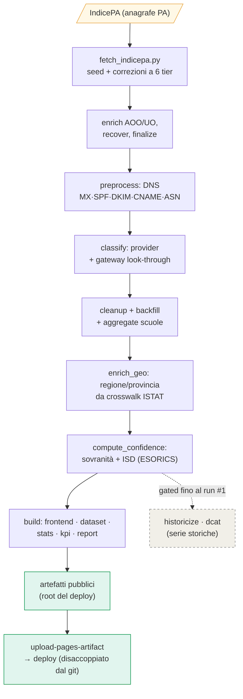

# MX Map Italia — Sovranità digitale della posta elettronica della PA

[](https://github.com/fpietrosanti/mxmap.it/actions/workflows/nightly.yml)
[](https://github.com/fpietrosanti/mxmap.it/actions/workflows/ci.yml)
[](https://creativecommons.org/licenses/by-sa/4.0/deed.it)

Motore dati dell'**[Osservatorio Nazionale Sovranità Digitale](https://github.com/fpietrosanti/osservatorio-nazionale-sovranita-digitale)**.
Classifica, tramite **analisi DNS pubblica** (record MX, SPF, DKIM, CNAME), *chi gestisce
la posta elettronica* di **~22.987 enti** della Pubblica Amministrazione italiana
(registrati in IndicePA) e ne misura la **sovranità**: italiana, UE o **extra-UE soggetta
al CLOUD Act** statunitense. Ne produce una mappa interattiva, statistiche, un report e dati aperti.

🌐 **[mxmap.it](https://mxmap.it/)** · 📊 [Statistiche](https://mxmap.it/statistiche.html) · 📄 [Report](https://mxmap.it/report.html) · 📖 [Metodologia](https://mxmap.it/methodology.html) · ⚠️ [Anomalie](https://mxmap.it/anomalie.html)

> **Nota.** Questo repo nasce come fork *mondiale* (166 paesi) di [mxmap.ch](https://mxmap.ch);
> **dal 2026 il focus attivo è l'Italia**, come motore dell'Osservatorio. L'infrastruttura
> multi-paese resta disponibile e documentata (vedi [`CLAUDE.md`](CLAUDE.md)). Questo README
> descrive il progetto **Italia**.

---

## Ecosistema a due progetti

| | |
|---|---|
| **MxMap (questo repo)** | Il **motore dati**. Misura e classifica; produce `data.json` + artefatti pubblici statici alla root del deploy. |
| **[Osservatorio Nazionale Sovranità Digitale](https://github.com/fpietrosanti/osservatorio-nazionale-sovranita-digitale)** | Il livello di **presentazione/advocacy** (sito Hugo). **Scarica e pesca** i nostri artefatti (`kpi.json`, `report.json`) e li renderizza per gli stakeholder. |

Il confine è netto: **qui si misura, lì si racconta.** Il contratto sono file statici (no API, no auth, CC BY-SA 4.0).

## Come funziona — dalla A alla Z

### 1. La pipeline notturna



Tre stadi classici (`preprocess` → `postprocess` → `validate`) operano su `data.json`, poi una
**coda deterministica** lo arricchisce e ne deriva gli artefatti pubblici. Dettaglio in
[`CLAUDE.md`](CLAUDE.md) e [`methodology.html`](methodology.html).

### 2. Il modello di sovranità

La classificazione canonica è `sovereignty_of()` / `material_row()` in
[`src/mail_sovereignty/historicize.py`](src/mail_sovereignty/historicize.py) — **unica fonte di
verità**, riusata da stats, kpi e report.

- **6 bucket MxMap:** `USA (CLOUD Act)` · `Altri provider esteri` · `Italia — Cloud sovrano` · `Italia — Provider commerciali` · `Italia — Infrastruttura autonoma` · `Sconosciuto`.
- **4 bucket Osservatorio** (`kpi.provider_to_sov4`): `extra_eu` · `eu_non_it` (oggi vuoto, punto di estensione per OVH/Hetzner…) · `it` · `unknown`.
- **ISD — Indice di Sovranità Digitale:** % enti in giurisdizione italiana, **sui classificati**, basato sulla sovranità del *provider* (controllo legale). `mx_jurisdiction` (dove risiede l'MX) è l'indicatore *tecnico* complementare — lo scarto fra i due è esso stesso un dato.

### 3. I due assi di lettura

- **Per gruppo** — 15 cluster citizen (Comuni, Istruzione, Sanità, …) dal codice categoria del seed. Copertura totale.
- **Per area** — regione/provincia da `enrich_geo` (crosswalk ufficiale ISTAT sulla chiave-sede `ipa_codice_comune_istat`): **20/20 regioni, 100% di copertura**.

### 4. Artefatti pubblici (alla root del deploy)

| File / pagina | Cosa |
|---|---|
| [`kpi.json`](https://mxmap.it/kpi.json) | KPI aggregati (sovranità 4-bucket, top provider, per cluster). Fetchato dall'Osservatorio. |
| [`report.json`](https://mxmap.it/report.json) | Il report strutturato (sintesi, fotografia, settori, aree, andamento, metodologia). |
| [`statistiche.html`](https://mxmap.it/statistiche.html) | Cruscotto KPI live. |
| [`report.html`](https://mxmap.it/report.html) | Report stile management-consulting (grafici a torta, raccomandazioni, metodologia in calce). |
| `storia.html` | Andamento nel tempo *(gated: parte dal run #1)*. |
| `dist/mxmap_it_dataset.{csv,json,xlsx}` | Dataset completo opendata. |

## Dati aperti — download (sempre l'ultima versione)

`data.json` contiene **solo l'Italia** (gli enti del fork mondiale sono rimossi da
[`scripts/strip_to_it.py`](scripts/strip_to_it.py)). I file sotto sono **rigenerati ogni notte**:
il link punta **sempre all'ultima versione disponibile** (la data è nel campo `generated`).

- **CSV** — <https://mxmap.it/dist/mxmap_it_dataset.csv>
- **JSON** — <https://mxmap.it/dist/mxmap_it_dataset.json>
- **XLSX** — <https://mxmap.it/dist/mxmap_it_dataset.xlsx>
- **KPI aggregati** — <https://mxmap.it/kpi.json> · **Report** — <https://mxmap.it/report.json>

Licenza **CC BY-SA 4.0**.

## Corner case (la fonte è sporca — è il cuore del progetto)

- **IndicePA non è una base dati pulita.** I domini email sono incoerenti/incompleti: l'intera pipeline esiste per *rielaborarla*. È una dipendenza funzionale core → **[issue #2](https://github.com/fpietrosanti/mxmap.it/issues/2)**.
- **Geografia (ISTAT).** Il campo `region` del seed è sporco (a volte è il nome dell'ente); usiamo la chiave-sede `ipa_codice_comune_istat` sul crosswalk ISTAT. **Sardegna:** IndicePA usa i codici provincia *legacy* pre-riforma 2016 (prefissi 112-119) assenti dal crosswalk → mappati esplicitamente a regione Sardegna (vedi `geo.py`).
- **Storicizzazione gated.** Le serie storiche partono dal **run #1** (primo scan pulito dopo la chiusura delle ~700 anomalie, [issue #4](https://github.com/fpietrosanti/mxmap.it/issues/4)). Fino ad allora `historicize`/`dcat` sono disattivati.
- **Una sola realtà.** Nessuna distinzione "reality vs methodology": la metodologia si congela al run #1.
- **Vincoli editoriali del report.** Stile consulting; si guida con gli estremi segmentati; la PA Centrale (ministeri, numeri piccoli, tema sensibile) è tenuta **fuori dall'allarme di testata** (`SPOTLIGHT_EXCLUDE`).
- **I numeri non devono mai sbagliare.** Ogni KPI ha unit test + `assert_integrity()` a runtime (vedi sotto).
- **Nightly indistruttibile.** Il deploy è **disaccoppiato** dal commit git (pubblica l'artifact costruito nel run); un fallimento del commit non blocca il sito.

## Avvio rapido

```bash
uv sync
uv run preprocess IT        # DNS + classificazione (Italia)
uv run postprocess
uv run python3 scripts/enrich_geo.py --country IT     # regione/provincia (ISTAT)
uv run python3 scripts/compute_confidence.py --country IT
uv run python3 scripts/build_stats.py   # → data/summary/stats_*.json
uv run python3 scripts/build_kpi.py     # → kpi.json
uv run python3 scripts/build_report.py  # → report.json
python -m http.server       # mappa + pagine in locale
```

## Sviluppo & test

```bash
uv sync --group dev
uv run pytest --cov --cov-report=term-missing   # soglia copertura: fail_under=84
uv run ruff check src tests
uv run ruff format src tests                     # OBBLIGATORIO prima di committare src/tests
```

**Regola: i numeri vanno sempre testati e verificati.** Ogni generatore di KPI vive in
`src/mail_sovereignty/` con (1) unit test su fixture a valori noti e (2) `assert_integrity()`
eseguito a ogni build (la pipeline fallisce se i numeri non tornano). Vedi
[`docs/STATS_KPI.md`](docs/STATS_KPI.md) e [`CLAUDE.md`](CLAUDE.md).

## Roadmap

La roadmap completa è in **[`docs/ROADMAP.md`](docs/ROADMAP.md)**, derivata dalle
[issue aperte](https://github.com/fpietrosanti/mxmap.it/issues):

1. **Baseline dato** → sistemare le ~700 anomalie (#4) → run #1 → storicizzazione live.
2. **Asse geografico** → ✅ crosswalk comune→regione strutturale; resta l'affinamento provincia/comune Sardegna.
3. **Bonifica fonte** → software qualità IndicePA (#2).
4. **Attendibilità** → metodo Email-Bounce (#5).
5. **Diagnostica** → pagina dimensioni + segnala-errore (#6).
6. **Attivazione stakeholder** → emailing per-stakeholder + integrazione Osservatorio (#3).

## Architettura & come contribuire

- **[`CLAUDE.md`](CLAUDE.md)** — contesto completo per chi contribuisce (anche assistito da Claude): ecosistema, modello di sovranità, decisioni, vincoli, convenzioni.
- **[`docs/`](docs/)** — `STATS_KPI.md` (catalogo KPI), `ROADMAP.md`, `HISTORICIZATION_DESIGN.md`, `BOUNCE_VERIFIER_DESIGN.md`, `countries/` (guide per-paese).
- Segnalazioni di misclassificazione: apri una issue con l'ID dell'ente e il provider corretto, oppure aggiungi una correzione a `MANUAL_OVERRIDES` in `postprocess.py`.

## Attribuzione & progetto originale

Fork di **[mxmap.ch](https://mxmap.ch)** di **[David Huser](https://github.com/davidhuser/mxmap)**
(mappa dei provider email dei comuni svizzeri). Esteso da
[livenson/mxmap](https://github.com/livenson/mxmap) a 166 paesi, e qui specializzato sull'Italia
con il modello di sovranità, il crosswalk ISTAT, la storicizzazione e gli artefatti per
l'Osservatorio.

- [mxmap.ch](https://mxmap.ch) — la mappa svizzera originale
- [hpr4379 — Mapping Municipalities' Digital Dependencies](https://hackerpublicradio.org/eps/hpr4379/index.html)

## Licenza

Dati e contenuti rilasciati sotto **[CC BY-SA 4.0](https://creativecommons.org/licenses/by-sa/4.0/deed.it)**.

---

> 🛠️ *Questo README va tenuto aggiornato: ad ogni commit di una feature o di un cambiamento
> significativo, aggiorna le sezioni rilevanti (come funziona, corner case, roadmap, artefatti).*
